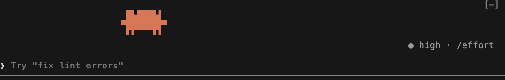
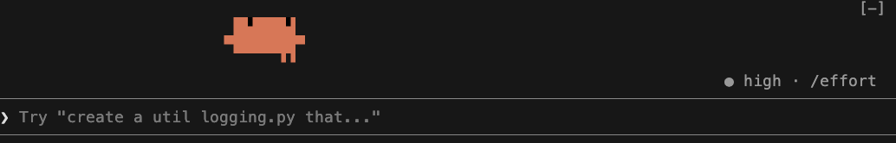
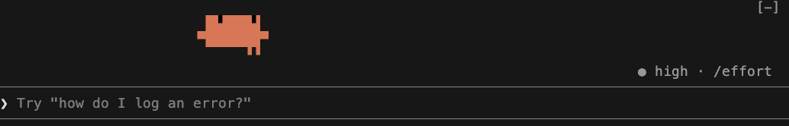
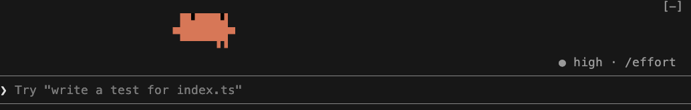
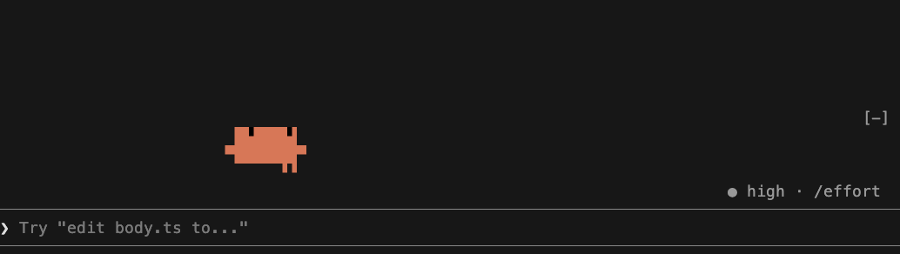

# buddy-go

住在 Claude Code 輸入框上方的吉祥物 buddy（Clawd）。平常來回走路，特定時機會播動畫。

```
 ▐▛███▛█
▝▜██████▀
 ▝▝   ▝▝
```

## 安裝

在 Claude Code 終端機的輸入框打：

```
/plugin install buddy-go --marketplace magiclin99/buddy-go
```

開發時直接從資料夾載入：

```bash
claude --plugin-dir /path/to/buddy-go
```

## 動畫

### 走路



沒有其他動畫時。

### your turn



AI 的回覆結尾在問你問題，或用提問工具問你時。buddy 原地消失、閃現在最左邊、揮手。

祕技：`buddy:your-turn`

### 思考



AI 在想的時候（模型串流出 thinking 的那段）。buddy 不再橫越整條，改在原地附近來回踱步：走幾步、停下來單手托頭閉眼想一下、轉身走回來，頭旁冒著 `. o O` 的泡泡。想超過 5 秒腳步變快，超過 15 秒臉變紅、冒汗。想完（開始回話或呼叫工具）的瞬間他停住、雙手舉高、閃一下，泡泡換成 `!`；想不到 2 秒就結束的不演這段。之後從踱到的位置繼續走。

祕技：`buddy:think 秒數`（預設 8 秒）

### 打字



編輯檔案時（`Edit`、`Write`、`NotebookEdit`）。buddy 停在原地打字，旁邊一行一行長出程式碼，底下標著檔名。

祕技：`buddy:edit 檔名`

### 跑步


執行指令時（`Bash`）。地面先出現，buddy 閃現到正中間、做起跑動作後開跑；他固定在中間不動，動的是往左捲的地面和樹。指令寫在他身後拖著的布條上。跑超過 10 秒會冒汗。連續的指令算同一場：每個指令結束後他會再跑 3 秒、頭旁閃一下綠色的 `Finish!` 或紅色的 `Oops!`，這段時間內有新指令就接著跑、布條換字；沒有才停下來歡呼或絆倒，之後從中間繼續走。

祕技：`buddy:run 指令`（跑 6 秒）

### PR 元氣彈



執行 `gh pr create` 時。buddy 舉手集氣，球長大後丟出去。

祕技：`buddy:send-pr`

### 祕技

祕技直接打在輸入框（前面不加斜線），會被 mod 攔下、不會送給模型。

## 結構

```
hooks/
├── register.tsx        串接：計時、發布狀態、祕技、繪製
├── animations/         一個動畫一個檔案，加上登記表 index.ts
│   ├── walk.ts
│   ├── wait.ts
│   ├── think.ts
│   ├── edit.ts
│   ├── run.ts
│   └── launch.ts
└── lib/
    ├── player.ts       播放器：現在播誰、誰在排隊、buddy 站在哪（純邏輯）
    ├── body.ts         buddy 的身體部件
    ├── render.tsx      把動畫輸出的資料轉成畫面元件
    └── frame.ts        共用型別
tests/
├── player.test.ts      播放器規則
├── animations.test.ts  每個動畫的畫格內容
└── walk.test.tsx       事件觸發到畫面的整合測試
demo/
├── record.sh           把每個動畫錄成 GIF
├── settings.json       錄影用：只載入這個資料夾的版本
└── *.gif               README 用的動畫
```

### 新增一個動畫

1. 在 `hooks/animations/` 新增一個檔案，匯出一個 `Animation`（名稱、優先順序、格數、每格多久、`draw`），需要的話再匯出觸發函式和宣告祕技名稱。
2. 在 `hooks/animations/index.ts` 的 `ANIMATIONS` 加一行；有觸發函式的話在 `registerTriggers` 加一行。

`draw` 是純計算：輸入第幾格與 buddy 的位置，輸出要畫的字和顏色，不碰計時器也不碰引擎。

## 開發

```bash
claude plugin validate .
claude plugin test .
```

### 重錄動畫 GIF

上面的 GIF 是在真的 Claude Code session 裡打祕技錄下來的，需要 `vhs` 和 `ffmpeg`（`brew install vhs ffmpeg`）：

```bash
demo/record.sh          # 全部重錄
demo/record.sh think    # 只錄一支
```

要多錄一支動畫，在 `demo/record.sh` 最底下加一行 `record 檔名 "祕技" 秒數`。
